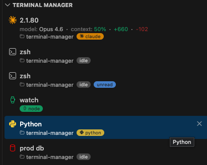
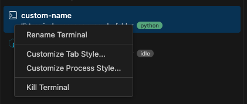
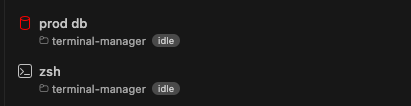
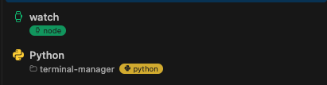
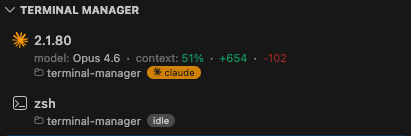

# Terminal Manager

An enhanced terminal overview panel for VS Code. See all your terminals at a glance with running process names, status badges, working directories, and custom details powered by external scripts.



## Features

- **Terminal list** in the Explorer sidebar with name, icon, and color
- **Status badges** — running/idle indicators with customizable colors and icons per process
- **Unread detection** — highlights terminals that produced output while in the background, with optional system notifications
- **Working directory** — shows the current directory for each terminal via shell integration
- **Custom details** — display arbitrary key-value data from external scripts (e.g. Claude Code session info, model name, context usage)
- **Dynamic styling** — detail field colors and icons can be driven by the data itself via variable references

## Context Menu

Right-click any terminal in the panel for quick actions:



- **Rename Terminal** — opens VS Code's built-in rename dialog
- **Customize Tab Style...** — adds a `tabStyles` rule for the terminal's name and opens your settings JSON
- **Customize Process Style...** — adds a `processStyles` rule for the currently running process (only shown when a process is running)
- **Kill Terminal** — terminates the terminal

The customize options pre-fill a new rule with the terminal or process name as the match pattern, with empty `icon` and `color` fields ready for you to fill in.

## Requirements

- VS Code 1.93.0 or later
- Shell integration enabled (default in VS Code) for running/idle detection and cwd

## Extension Settings

### `terminalManager.fields`

Ordered list of fields to display for each terminal. Available fields:

| Field | Description |
|-------|-------------|
| `name` | Terminal name with icon, color, and kill button |
| `cwd` | Current working directory name (requires shell integration) |
| `status` | Running process name or idle badge |
| `unread` | Badge shown when a background terminal has new output |
| `details` | Custom variables from `/tmp/terminal-manager/{pid}.json` |

**Default:** `["name", "cwd", "status", "unread"]`

```json
"terminalManager.fields": ["name", "cwd", "status", "unread", "details"]
```

---

### `terminalManager.tabStyles`

Style rules applied to terminals by name. Each rule has a `match` regex tested against the terminal name. First matching rule wins.



| Property | Type | Description |
|----------|------|-------------|
| `match` | `string` | **Required.** Regex pattern matched against the terminal name |
| `icon` | `string` | Codicon id (e.g. `terminal`, `rocket`, `bug`, `gear`) |
| `color` | `string` | Theme color id (e.g. `terminal.ansiGreen`) or CSS color |

```json
"terminalManager.tabStyles": [
  { "match": "claude", "icon": "hubot", "color": "terminal.ansiCyan" },
  { "match": "server", "icon": "server", "color": "terminal.ansiGreen" }
]
```

---

### `terminalManager.processStyles`

Style rules for the running-process status badge. Each rule has a `match` regex tested against the process name. First matching rule wins.

When a terminal is using the default icon/color (no `tabStyles` match and no custom `creationOptions`), the process style's `icon` and `color` will also override the terminal's tab icon and color while the process is running.



| Property | Type | Description |
|----------|------|-------------|
| `match` | `string` | **Required.** Regex pattern matched against the running process name |
| `icon` | `string` | Codicon id for the badge. Also overrides the terminal tab icon while running (if using defaults) |
| `color` | `string` | Theme color id or CSS color for the badge background. Also overrides the terminal tab color while running (if using defaults) |

```json
"terminalManager.processStyles": [
  { "match": "node", "icon": "symbol-event", "color": "terminal.ansiGreen" },
  { "match": "python", "icon": "symbol-misc", "color": "terminal.ansiYellow" },
  { "match": "claude", "icon": "hubot", "color": "orange" },
  { "match": "npm|pnpm|yarn", "icon": "package", "color": "terminal.ansiCyan" }
]
```

---

### `terminalManager.details.fields`

Variable names to display when the `details` field is enabled. Each entry is a top-level key read from the terminal's data file at `/tmp/terminal-manager/{pid}.json`.

**Default:** `[]`

```json
"terminalManager.details.fields": ["model", "context", "lines_added", "lines_removed"]
```

---

### `terminalManager.details.fieldStyles`

Style rules for detail fields. Each rule has a `match` regex tested against the variable name. First matching rule wins.

Values starting with `$` are resolved from the same terminal's variables, allowing the data source to dynamically control styling.



| Property | Type | Description |
|----------|------|-------------|
| `match` | `string` | **Required.** Regex pattern matched against the variable name |
| `color` | `string` | Text color. CSS color, theme color id, or `$VAR_NAME` to read from the terminal's data |
| `icon` | `string` | Codicon id to display before the value. Can also be `$VAR_NAME` |
| `label` | `string` | Override the display label. Can also be `$VAR_NAME`. Set to `""` to hide the label |

```json
"terminalManager.details.fieldStyles": [
  { "match": "context", "color": "$context_color", "label": "ctx" },
  { "match": "lines_added", "color": "$lines_added_color", "label": "" },
  { "match": "lines_removed", "color": "$lines_removed_color", "label": "" }
]
```

### `terminalManager.notifications`

Enable system notifications when a background terminal needs attention. Notifications are triggered by:

1. **Shell execution events** — when a command finishes in a non-active terminal
2. **Idle detection** — when a terminal's vars JSON stops being updated (e.g. Claude finished processing), a notification fires after a 10-second debounce
3. **Explicit notifications** — when a `notification` field is written to the terminal's `/tmp/terminal-manager/{pid}.json` data file (e.g. by a Claude Code `Notification` hook for permission prompts)

**Default:** `false`

```json
"terminalManager.notifications": true
```

When a notification fires, it includes a **Show** button to jump directly to the terminal.

#### Claude Code integration

To get notifications when Claude Code needs your attention (permission prompts, finished processing), add two hooks to your `~/.claude/settings.json`:

1. **Statusline hook** — writes session data to the vars JSON. The extension detects when updates stop (Claude is idle) and fires a "Claude is done" notification.

2. **Notification hook** — fires immediately when Claude needs permission, writing a `notification` field to the vars JSON.

```json
{
  "statusLine": {
    "type": "command",
    "command": "/bin/bash ~/.claude/notification-hook.sh"
  },
  "hooks": {
    "Notification": [
      {
        "hooks": [
          {
            "type": "command",
            "command": "/bin/bash ~/.claude/notification-hook.sh"
          }
        ]
      }
    ]
  }
}
```

**`~/.claude/notification-hook.sh`** — writes the notification message to the vars JSON:

```bash
#!/bin/bash
input=$(cat)

dir="${TMPDIR:-/tmp}/terminal-manager"
pid=$PPID
file="$dir/$pid.json"

message=$(echo "$input" | jq -r '.message // "Claude needs your attention"')
# Append timestamp so the extension detects each as a new transition
message="$message @$(date +%s)"

if [ -f "$file" ]; then
  vars=$(cat "$file")
else
  mkdir -p "$dir"
  vars="{}"
fi

echo "$vars" | jq --arg v "$message" '. + {notification: $v}' > "$file"
```

The statusline script from the example below handles writing the vars JSON. It also preserves any `notification` field set by the Notification hook so the extension can pick it up before the next statusline update clears it.

---

## Custom Details via External Scripts

The `details` field reads from JSON files written to `/tmp/terminal-manager/{pid}.json`, where `{pid}` is the terminal's shell process ID. Any script, shell hook, or tool can write to this file to surface custom information in the terminal panel.

### File format

A flat JSON object with string values:

```json
{
  "model": "Opus 4.6",
  "context": "73%",
  "context_color": "terminal.ansiGreen",
  "lines_added": "+42",
  "lines_added_color": "terminal.ansiGreen",
  "lines_removed": "-10",
  "lines_removed_color": "terminal.ansiRed"
}
```

Variables ending in `_color` (or any naming convention you choose) can be referenced in `fieldStyles` using the `$` prefix to dynamically control styling from the data source.

### Example: Claude Code integration

Add a [statusline hook](https://docs.anthropic.com/en/docs/claude-code/customization#status-bar-hooks) to Claude Code that writes session data:

```bash
#!/bin/bash
input=$(cat)

# Extract fields from Claude's status JSON
model=$(echo "$input" | jq -r '.model.display_name // empty')
context_remaining=$(echo "$input" | jq -r '.context_window.remaining_percentage // empty')

# Compute dynamic color
if (( $(echo "$context_remaining < 20" | bc -l) )); then
  ctx_color="terminal.ansiRed"
elif (( $(echo "$context_remaining < 50" | bc -l) )); then
  ctx_color="terminal.ansiYellow"
else
  ctx_color="terminal.ansiGreen"
fi

# Write to the terminal manager data file
dir="${TMPDIR:-/tmp}/terminal-manager"
mkdir -p "$dir"
jq -n --arg m "$model" --arg c "$(printf '%.0f%%' "$context_remaining")" --arg cc "$ctx_color" \
  '{model: $m, context: $c, context_color: $cc}' > "$dir/$PPID.json"
```

Then configure the extension:

```json
{
  "terminalManager.fields": ["name", "status", "details"],
  "terminalManager.details.fields": ["model", "context"],
  "terminalManager.details.fieldStyles": [
    { "match": "context", "color": "$context_color" }
  ]
}
```

## Color Values

All color properties across `tabStyles`, `processStyles`, and `fieldStyles` accept:

- **Theme color ids** — e.g. `terminal.ansiRed`, `terminal.ansiGreen`, `terminal.ansiCyan`
- **CSS colors** — e.g. `orange`, `#ff5500`, `rgb(255, 85, 0)`

Available theme colors: `terminal.ansiBlack`, `terminal.ansiRed`, `terminal.ansiGreen`, `terminal.ansiYellow`, `terminal.ansiBlue`, `terminal.ansiMagenta`, `terminal.ansiCyan`, `terminal.ansiWhite`

## Icons

All icon properties accept [Codicon](https://microsoft.github.io/vscode-codicons/dist/codicon.html) ids (e.g. `terminal`, `rocket`, `bug`, `gear`, `hubot`, `package`).

## Development

```bash
npm install
npm run compile    # Build
npm run watch      # Build in watch mode
npm run lint       # Lint with Biome
npm run format     # Format with Biome
npm run typecheck  # Type check with TypeScript
```
